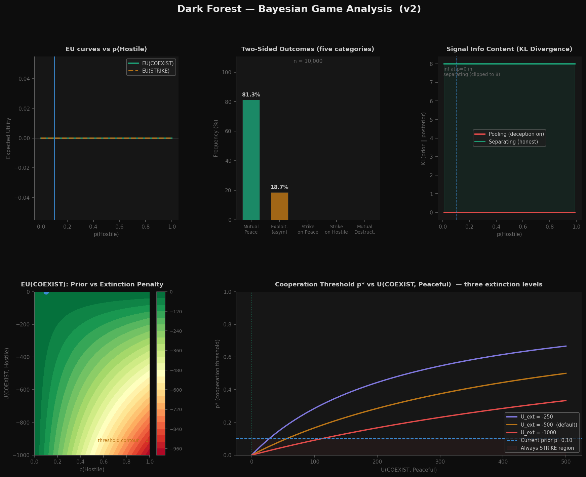

# 🌌 Dark Forest Bayesian Game Simulator


> *“The universe is not kind. It is silent—and rational.”*

A rigorous computational implementation of the **Dark Forest hypothesis** as a **Bayesian game of incomplete information**, inspired by *The Dark Forest* by Liu Cixin and popularized globally through the Netflix adaptation of *3 Body Problem*.

---

## 🧠 Overview

This project models first-contact decision-making between civilizations under extreme uncertainty:

- Are other civilizations **hostile or peaceful**?
- Can signals be **trusted or strategically manipulated**?
- Is cooperation ever rational when **extinction risk dominates**?

We formalize these questions using:

- Bayesian belief updates  
- Expected utility maximization  
- Incentive-compatible signaling  
- Two-sided Monte Carlo simulation  

> The result is a **fully consistent epistemic game engine**—not a toy model.

---

## ⚙️ Key Features

### 🔹 True Bayesian Game (Two-Sided)
- Independent type draws for both civilizations  
- Symmetric reasoning under incomplete information  
- Real stochasticity from joint type distributions  

---

### 🔹 Incentive-Compatible Signaling
- Deception is **derived**, not assumed  
- Pooling equilibrium only holds if **lying is rational**  
- Explicit verification of incentive compatibility (IC)  

---

### 🔹 Information-Theoretic Analysis
- Signal value measured via KL divergence  
- Pooling → **zero information**  
- Separating → **infinite information**  

---

### 🔹 Rich Outcome Decomposition
- Mutual peace  
- Mutual exploitation  
- Asymmetric predation  
- Strike on peaceful (unilateral aggression)  
- Strike on hostile (preemptive defense)  
- Mutual destruction  

---

## 📊 Results & Analysis



---

### 🧠 Key Observations

#### 🔴 1. Rationality Leads to Destruction

At the current prior:

```

p(Hostile) = 0.30

```

We are **above the cooperation threshold**:

```

p* ≈ 0.15

```

Result:

> **100% Mutual Destruction**

This is not random—it is a **deterministic equilibrium outcome**.

---

#### 📉 2. Cooperation is Extremely Fragile

- Below threshold → cooperation possible  
- Above threshold → preemptive strike dominates  

Even moderate uncertainty collapses cooperation.

---

#### ⚖️ 3. Expected Utility Drives Behavior

```

EU(COEXIST) = -80
EU(STRIKE)  = +10

````

> Rational agents always choose **STRIKE**

---

#### 🔥 4. Simulation Confirms Theory

Monte Carlo outcomes:

- 🟩 Mutual Peace: **0.0%**  
- 🟥 Mutual Destruction: **100.0%**  
- 🟨 Other outcomes: **0.0%**

> The simulation validates equilibrium—not randomness.

---

#### 🌡️ 5. Extinction Risk Dominates

As extinction penalty increases:

- Cooperation becomes irrational faster  
- Even small hostility probabilities trigger collapse  

---

#### 📈 6. Cooperation Requires Unrealistic Conditions

To sustain cooperation:

- Lower perceived hostility **OR**
- Dramatically increase cooperation rewards  

Otherwise:

> Preemptive destruction is always optimal.

---

## 🧮 Core Model

Each encounter follows a 3-stage Bayesian game:

1. **Nature** assigns types (Hostile / Peaceful)  
2. **Signaling** (truthful or deceptive if IC holds)  
3. **Action** (COEXIST or STRIKE based on expected utility)  

---

## 🖥️ Usage

```bash
python dark_forest.py
````

Interactive CLI allows:

* Parameter tuning
* Monte Carlo simulation
* Sensitivity analysis
* Plot generation

---

## 📁 Project Structure

```
dark_forest.py
├── Payoffs
├── BayesianBelief
├── DarkForestGame
├── SimulationResult
└── Visualization + UI
```

---

## 🎬 Cultural Context

This project is inspired by:

* 📖 *The Dark Forest* — Liu Cixin
* 🎥 *3 Body Problem* — Netflix adaptation

These works explore the unsettling idea that:

> Silence in the universe may be a consequence of **rational survival strategies**.

---

## 🚀 Roadmap

* [ ] Repeated / dynamic games
* [ ] Costly or noisy signaling
* [ ] Multi-agent simulations
* [ ] Evolutionary dynamics
* [ ] AI safety applications

---

## ⚖️ Disclaimer

This is a **theoretical simulation**, not a claim about real extraterrestrial behavior.

Its purpose is to explore:

> Rational decision-making under uncertainty and existential risk.

---

## 🤝 Contributing

Contributions welcome:

* New equilibrium models
* Alternative payoff structures
* Simulation experiments

---

## 📜 License

MIT License

---

## ✨ Final Thought

> In a universe where trust cannot be verified and survival is everything,
> silence may not be fear—
> it may be **strategy**.


